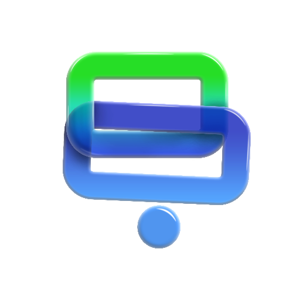

# Rayan Pardaz Molaanaa

### Pioneering Secure, Native Decentralized Architectures

 

---

## 🏢 About Us

**Rayan Pardaz Molaanaa** is a specialized software engineering firm dedicated to building high-performance decentralized applications (dApps). We refuse to compromise on user experience.

While the industry trends toward cross-platform frameworks, we specialize in **Native Mobile Architecture**. We believe that financial tools require the hardware-level optimization and cryptographic security that only native **Kotlin (Android)** and **Swift (iOS)** can provide.

Our mission is to bridge the gap between complex blockchain backends and elegant, pixel-perfect mobile interfaces.

---

## 🚀 Flagship Product: BABA Wallet
### *The Premier Non-Custodial Interface for the Credits Blockchain*

BABA Wallet represents the culmination of our engineering philosophy. It is the first fully native, non-custodial wallet designed specifically for the Credits ecosystem, granting users absolute control over their digital assets without intermediaries.

| Platform | Technology Stack | Key Characteristics |
| :--- | :--- | :--- |
| **🤖 Android** | **Kotlin** + Jetpack Compose | Reactive UI, Material Design 3, Coroutines |
| **🍎 iOS** | **Swift** + UIKit/SwiftUI | Human Interface Guidelines compliance, Metal optimization |
| **🛡️ Security** | **Non-Custodial** | Client-side key generation, AES encryption |
| **🌐 Global** | **Localization** | Native support for English, Persian, Russian, & Spanish |

---

## 🛠 Engineering Standards & Tech Stack

We maintain rigorous coding standards to ensure scalability and security. Our repositories reflect a commitment to clean code and modern architecture.

### Mobile Ecosystem

* **Architectural Patterns:** MVVM (Model-View-ViewModel), Clean Architecture.
* **UI Toolkits:** Jetpack Compose (Android), UIKit/SwiftUI (iOS).
* **Performance:** Multi-threaded background processing for seamless blockchain synchronization.

### Backend & Infrastructure

* **Runtime:** Node.js (Express.js) focused on low-latency API responses.
* **Data Persistence:** MongoDB for flexible schema management; Redis for high-speed caching.
* **DevOps:** Containerized deployment via Docker; managed Linux VPS infrastructure.
* **Blockchain Integration:** Direct interaction with Credits API Nodes.

---

## 👨‍💻 Leadership

**Mohsen (Molaanaa)**
*Founder & Lead Architect*

Rayan Pardaz Molaanaa is led by Mohsen, a specialist in native mobile development and blockchain integration. His focus on "Security First" architecture drives the company's technical direction.

---

### Connect With Us

*Open for collaboration on Blockchain Innovation and FinTech Solutions.*

[**🌐 Visit molaanaa.com**](https://molaanaa.com)

 

###### © 2025 Rayan Pardaz Molaanaa. All Rights Reserved.

